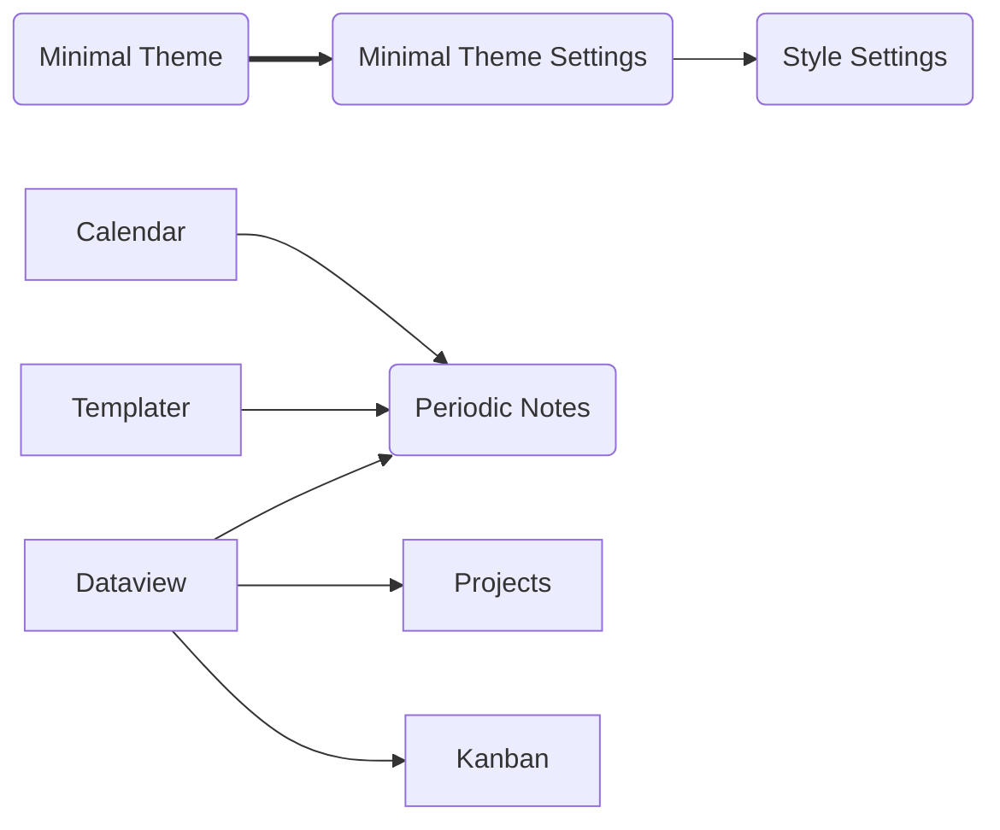

## Instruction

This is a small version of my personal note template for bullet journal taking. It contains about 10 frequently used third party templates.

**Folder structure**

- "1.Daily Log": it contains all daily notes
- "2.Weekly Log": it contains all weekly notes
- "3.Monthly Log": it contains all monthly notes
- "4.Future Log": it contains all future notes (future plans within 5 years)
- "5.Yearly Log": it contains all yearly results
- Excalidraw: a default folder to store all notes in Excalidraw
- Projects: contains all projects (generated by the Project folder)
- Template: contains all markdown templates to generate notes
- `pomodoro.md` contains a weblink for pomodoro working technique.
- `ZCOOLXiaoWei-Regular.tff` is a Chinese font I prefer to use

**Pre-installed extensions**

This is a list of all installed third party extensions in alphabetical order (I think they are very useful extentions):
- `Calendar`: A calendar file
- `Dataview`: Use SQL queries to create table view by querying information from notes, etc.
- `DB Folder`: Create Notion's databases.
- `Excalidraw`: A very useful project for visualization.
- `File Info Panel`: A panel showing more file information.
- `Kanban`: For task management using a file.
- `Mind Map`: Create mind map using markdown code
- `Minimal Theme Settings`: Minimal theme settings
- `Outlier`: It contains shortcuts for you to reorganize order of lists 
- `Periodic Notes`: A very useful tool to generate note following templates plus using calendar links.
- `Projects`: A easy way of managing projects.
- `Reminder`: Sometimes you can add a notification for you.
- `Spaced Repitition`: Generate learning plan for you to remember things in long term by reviewing following Ebbinghaus curve.
- `Style Settings`: A useful tool to combine with (Minimal Theme Settings) to set up styles.
- `Templater`: Useful for one to create note templates.

## Structure between third party extensions

Besides those "isolated" extentions, some extensions have some relationships/dependencies each other, as shown below:

The "Minimal Theme" is a popular theme I choose to use. Since it has status extensions for the TODO list, it is ideal for writing bullet journal (BUJO).

